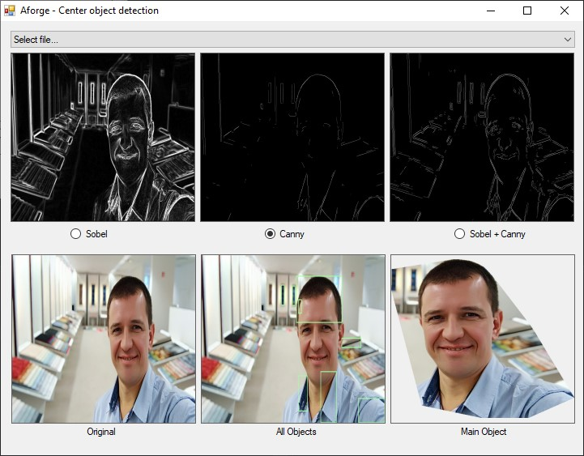

# BackgroundRemoval
AForge based library for removing background from images

## General description
It detects objects based on their edges, draws border around them and clips resulted object.  
Note that it biased towards detecting objects closer to the center
(object needs to be large to be detected at the corner of the image and it can be quite small and still be detected at its center).

## How it works
1) Image is converted to grayscale
2) Selected edge detector is applied
3) Blob counter with [gradient size](BackgroundRemoval/BackgroundRemoval.cs#L48) is applied to find all the objects
4) Convex hull is created around them
5) Image inside said convex hull is returned

## Demo images

